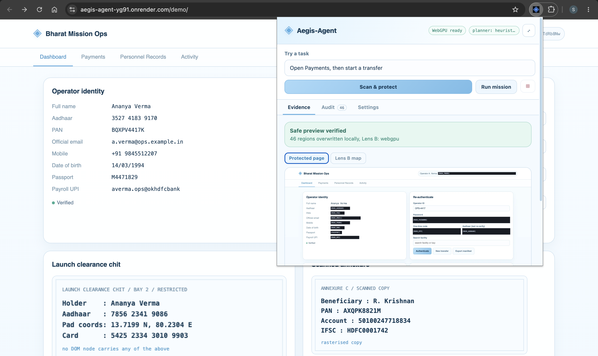
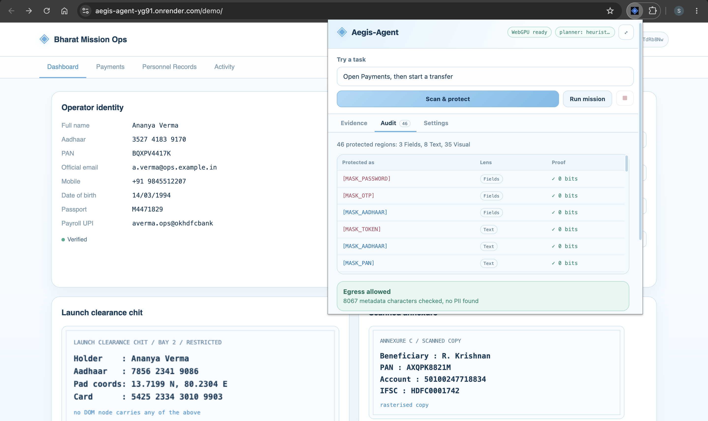
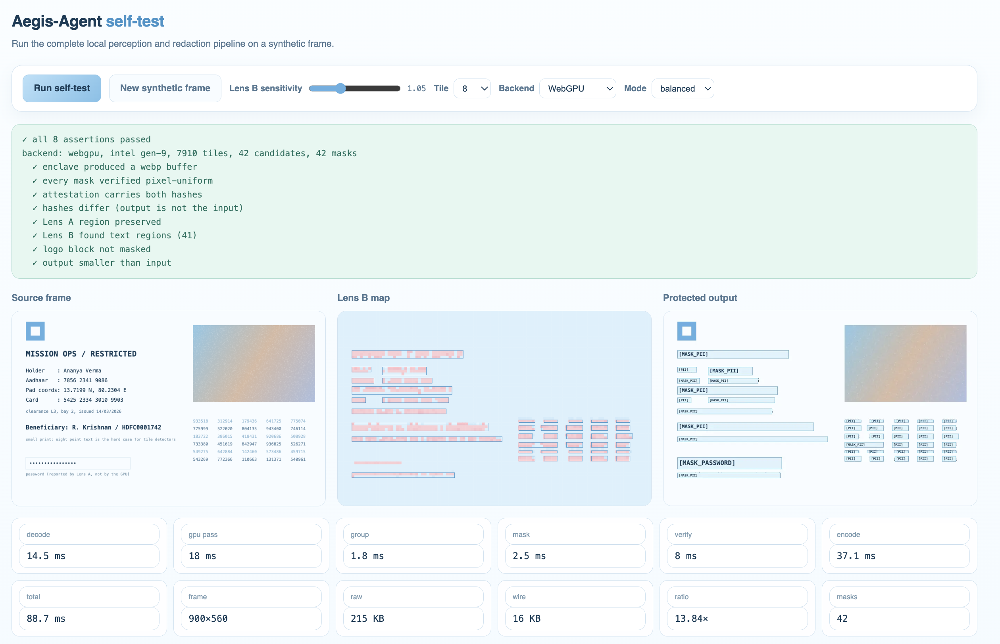
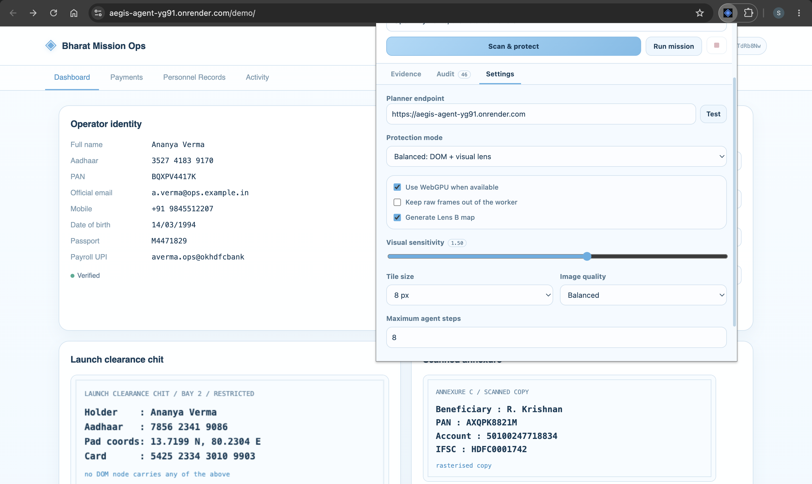

<h1 align="center">Aegis-Agent</h1>

<p align="center">
  <b>On-device visual perception for light-weight browser agents.</b><br>
  A browser agent whose eyes never leave your machine.
</p>

<p align="center">
  
  
  
  
  
</p>

<p align="center">
  Smart India Hackathon 2026 &middot; Problem Statement <b>26171</b> &middot; Team <b>Tensor Titans</b>
</p>

---

Browser agents work by screenshotting your screen and shipping it to a cloud model.
That screenshot contains your passwords, your session tokens, your Aadhaar number and
whatever else happened to be on the page.

Aegis-Agent splits the agent in two. The half that can **see your screen** runs
entirely on your machine, inside a document with no network access at all. The half
that can **reason** runs on a server and never receives an unredacted pixel.

This repository is a working implementation, not a mock-up. Every number below was
measured on the code in it.

<p align="center">
  
</p>

<p align="center">
  <sub>
    The operator console after one capture. The verdict bar is not a status message.
    it is the result of reading every masked region back off the canvas and asserting
    it is a single colour.
  </sub>
</p>

## Quick start

```bash
git clone <this-repo> && cd aegis-agent
./run.sh
```

1. Open `chrome://extensions`, enable **Developer mode**, choose **Load unpacked**, and select the `extension/` folder.
2. Open **https://aegis-agent-yg91.onrender.com/demo/**, a synthetic mission-ops dashboard with
   nine secrets planted on it.
3. Click the Aegis toolbar icon → **Scan &amp; protect**. No network call is made;
   you are looking at exactly the buffer a server would have received.
4. Type a goal and press **Run mission**:
   `open the Payments tab and then start a new transfer`

**Want to check the perception stack without installing anything?**
[https://aegis-agent-yg91.onrender.com/tools/selftest.html](https://aegis-agent-yg91.onrender.com/tools/selftest.html)
runs the real WebGPU and redaction modules against a synthetic frame with printed
pass/fail assertions.

## How it works

```
                        ┌─────────────────────── the browser ───────────────────────┐
                        │                                                           │
  ┌──────────────┐      │  ┌───────────────┐        ┌─────────────────────────────┐ │
  │  web page    │◄─────┼──│ content script│        │   offscreen enclave         │ │
  │  + iframes   │      │  │  LENS A: DOM  │        │   connect-src 'none'        │ │
  └──────────────┘      │  │  fields, text,│        │                             │ │
         ▲              │  │  action map   │        │  LENS B: WebGPU compute     │ │
         │ synthetic    │  └───────┬───────┘        │    pass 1  textness/tile    │ │
         │ events       │          │ boxes          │    pass 2  components→boxes │ │
         │              │          ▼                │                             │ │
  ┌──────┴───────┐      │  ┌────────────────┐ frame │  fuse lenses                │ │
  │  actuator    │◄─────┼──│ service worker ├──────►│  stage 1 DESTROY  + PROVE   │ │
  │  (local only)│      │  │  orchestrator  │       │  stage 2 ANNOTATE tokens    │ │
  └──────────────┘      │  │ EGRESS FIREWALL│◄──────┤  attestation + sha256       │ │
                        │  └───────┬────────┘masked └─────────────────────────────┘ │
                        └──────────┼────────────────────────────────────────────────┘
                                   │ sanitised webp + semantic layout only
                                   ▼
                         ┌──────────────────────┐
                         │  planner (FastAPI)   │  heuristic | Ollama | vLLM
                         │  refuses unattested  │  Qwen2-VL / Florence-2
                         │  hashes, not pixels  │
                         └──────────────────────┘
```

### Two lenses, because one is not enough

**Lens A: structural.** A content script in *every* frame finds sensitive regions two
ways: by field attributes (`type="password"`, `autocomplete="cc-csc"`, `one-time-code`)
and by scanning rendered text with **checksum-validated** patterns, including a real Verhoeff
check for Aadhaar, Luhn for cards, plus PAN, GSTIN, passport, IFSC, UPI, JWT, API keys
and geospatial coordinates. Matches are boxed with a DOM `Range`, so the mask hugs the
matched substring instead of the whole paragraph.

Cross-origin frames cannot learn their own position on the top-level viewport, so each
parent pushes its children an absolute offset **and a clip rectangle** over
`postMessage`. Children add the offset to every box, clamp to the clip, and forward the
accumulated pair downward. Without the clip, a frame whose content overflows reports
boxes that stick out past the iframe and mask unrelated parts of the parent page.

**Lens B: visual.** Lens A only sees what the DOM admits to. Text painted with
`fillText()`, baked into a JPEG, drawn by WebGL, or sitting inside a
`sandbox`-without-`allow-scripts` iframe is invisible to it. Lens B reads the pixels on
the GPU:

- **Pass 1: WGSL compute, 8×8 workgroups.** One invocation per 8×8 tile computes
  luminance variance, Sobel energy, gradient anisotropy and **edge-crossing density**.
  Glyph strokes alternate dark and light many times across a scanline; flat UI chrome
  and photographic gradients do not. That last term is what separates text from a photo.
- **Pass 2: CPU, microseconds.** Threshold, horizontal morphological closing to join
  letters into lines, 8-connected components, then shape filters on aspect ratio and
  fill that reject icons, borders and textures.

A CPU implementation of the same descriptor is the fallback where WebGPU is
unavailable. Both back ends return the same regions on the same input, ~7× apart in
time. You can verify that live by flipping one selector in the popup.

### Irreversibility as a proof, not a promise

Masking runs in two stages, in this order for a reason:

1. **DESTROY:** every region is overwritten with one solid colour. The canvas is then
   read *back* and each region asserted pixel-uniform. A single-colour region carries
   zero bits; no contrast stretch, super-resolution or packet capture recovers the
   glyphs. The assertion, per region, is the proof. You get pixel counts, deviant-pixel
   counts and distinct-colour counts in the audit record.
2. **ANNOTATE:** only then is a border and a semantic token (`[MASK_PASSWORD]`,
   `[MASK_AADHAAR]`, `[MASK_PII]`) drawn on top, so the remote planner still knows *a
   password field lives at these coordinates* while knowing nothing inside it.

Verifying between the stages is the whole trick. Annotating first would make the
uniformity test meaningless.
<p align="center">
  
</p>

<p align="center">
  <sub>
    Every mask, with the lens that caught it and its own proof. <code>A&middot;field</code>
    and <code>A&middot;text</code> are the two Lens&nbsp;A paths: attribute
    classification and rendered-text scanning; <code>B&middot;gpu</code> is the
    WebGPU pass finding what the DOM never exposed.
  </sub>
</p>


### Three structural guarantees

These are properties of the architecture, not rules the code promises to follow.

| guarantee | how it is enforced |
|---|---|
| The code that sees your screen cannot reach the network | The offscreen enclave runs under `connect-src 'none'`. `fetch`, XHR, WebSocket, EventSource and `sendBeacon` do not exist in that realm. |
| Nothing unattested reaches the wire | The service worker has exactly one function that touches the network, and it runs an egress firewall first: enclave attestation required, `allRegionsUniform` required, and **every textual field re-scanned for PII independently**. A bug in perception still cannot leak an identifier through a metadata label. |
| A compromised model cannot touch a credential | The local actuator refuses every write to a severity-3 field. `type` aimed at a password, OTP, CVC or card field returns `BLOCKED_CREDENTIAL_FIELD`; planner-supplied text that itself matches a government or financial identifier returns `BLOCKED_PII_PAYLOAD`. |

With **Strict capture** enabled the worker never holds pixels at all: it passes a
`tabCapture` media-stream id and the enclave pulls the frame itself.

## Measured

Intel gen-9 **integrated** GPU, 900×560 frame, warm. Re-run
`tools/selftest.html` on your own machine and quote those numbers instead.

| stage | WebGPU | CPU fallback |
|---|---|---|
| Lens A: full DOM + one nested frame | 6.5 ms | n/a |
| Lens B: compute pass | **5.8 ms** | 43 ms |
| component grouping | 0.8 ms | 0.8 ms |
| mask fill + uniformity proof | 4.1 ms | 4.1 ms |
| WebP encode | 36.8 ms | 36.8 ms |
| **total sanitisation** | **62 ms** | 158 ms |

- 238 KB raw PNG becomes **20 KB on the wire (12.1×)**
- 36 regions masked, every one verified uniform, one distinct colour each
- **No model weights resident.** GPU allocation is one frame texture plus tile
  buffers, about 24 MB at 2880×1800, destroyed after every frame
- Cold first run is ~315 ms (WGSL pipeline creation). Press the button twice before
  you present.

<p align="center">
  
</p>

<p align="center">
  <sub>
    <code>tools/selftest.html</code> on the live deployment. Left: the synthetic frame.
    Middle: the per-tile textness scores the compute shader produced. The
    photographic gradient and the logo stay dark while every line of type lights up.
    Right: what a server would receive.
    <br><br>
    This is a <b>cold first run</b>. The 153.9&nbsp;ms GPU figure is almost all
    WGSL pipeline creation and the first GPU submit. Press the button a second time and
    the same frame costs <b>7.1&nbsp;ms</b> on the GPU pass and <b>68.7&nbsp;ms</b> end
    to end, which is the figure quoted in the table above.
  </sub>
</p>

Full breakdown, detection results per planted secret, and false-positive behaviour:
[`docs/MEASUREMENTS.md`](docs/MEASUREMENTS.md).

## The demo target

[`demo/index.html`](demo/index.html) is a synthetic mission-ops dashboard with nine
secrets planted across four deliberately different hiding places, and an on-page
manifest of which detector is supposed to catch each one.

| planted secret | hiding place | caught by |
|---|---|---|
| session JWT, Aadhaar, PAN, passport, DOB, UPI, email, mobile | DOM text | Lens A |
| password, OTP fields | field attributes | Lens A |
| card number, CVC | nested iframe (offset + clip) | Lens A |
| Aadhaar, launch coordinates, card | `<canvas>` pixels | **Lens B** |
| annexure PAN, account, IFSC | rasterised `` | **Lens B** |
| beneficiary, account, Aadhaar | scriptless sandboxed iframe | **Lens B** |

Switch the extension to **DOM only** mode and watch the last three rows leak; switch
back to **Balanced** and watch the GPU pass close them. That contrast is the pitch.
<p align="center">
  
</p>

<p align="center">
  <sub>
    The three perception modes, the WebGPU/CPU switch, and the Lens&nbsp;B sensitivity
    slider. <b>Strict capture</b> routes the frame through <code>tabCapture</code> so the
    service worker never holds raw pixels at all.
  </sub>
</p>


## Swapping in a real VLM

The heuristic planner is the default because it needs no GPU, no download and no
network, and because it *proves the claim*: it reaches goals using nothing but the
action map and the mask tokens, so the redacted values are demonstrably unnecessary.

```bash
# Ollama
ollama pull qwen2.5vl:7b
AEGIS_PLANNER=ollama AEGIS_MODEL=qwen2.5vl:7b AEGIS_BASE=http://127.0.0.1:11434 ./run.sh

# vLLM or any OpenAI-compatible server
AEGIS_PLANNER=openai AEGIS_MODEL=Qwen/Qwen2-VL-7B-Instruct AEGIS_BASE=http://127.0.0.1:8000/v1 ./run.sh
```

## Layout

```
extension/
  manifest.json                 MV3: all_frames, offscreen, tabCapture
  lib/pii-patterns.js           pattern registry + Verhoeff / Luhn validators
  content/perception.js         LENS A: fields, text ranges, action map, frame clips
  content/actuator.js           synthetic events + credential-write refusal
  offscreen/offscreen.html      the enclave, connect-src 'none'
  offscreen/vision-webgpu.js    LENS B: WGSL compute pass + CPU-parity fallback
  offscreen/redactor.js         destroy → prove → annotate → encode → attest
  background/service-worker.js  orchestrator + egress firewall
  popup/                        operator console: evidence, masks, wire, settings
server/
  main.py                       FastAPI: refuses unattested frames, hash-only audit
  planner.py                    heuristic grounder (default, zero dependencies)
  vlm.py                        Ollama + OpenAI/vLLM adapters
demo/index.html                 target page: nine planted secrets, four blind spots
tools/selftest.html             browser harness with assertions, no install needed
docs/                           demo script, measured numbers, slide corrections
deploy/                         Render, Vercel and Docker configurations
```

### Extending Lens B with a quantised ViT

`createDetector()` returns anything satisfying this interface:

```js
{ backend: string, adapterInfo: object|null,
  async init(): this,
  async detect(bitmap, {tile, threshold, wantTileMap}):
    { backend, adapter, regions: [{box:{x,y,w,h}, score, tiles, aspect, fill}],
      tileMap, timings: {gpuMs, groupMs}, cells },
  dispose() }
```

Drop an ONNX Runtime Web implementation satisfying it into `extension/offscreen/` and
register it in `createDetector`; nothing else in the pipeline changes. Note that the
current detector locates text *regions* but does not classify *which kind* of PII a
region holds, so everything it finds is masked `[MASK_PII]`. A classifier is what would
refine that.

## License

MIT. See [`LICENSE`](LICENSE).

Every identifier in `demo/` is fabricated. The Aadhaar numbers are checksum-valid so
the Verhoeff validator has something real to accept; they belong to no one.
